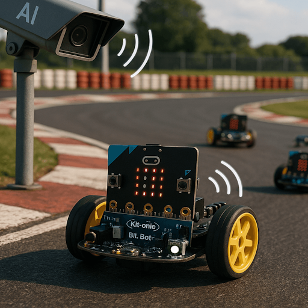

# FaceRace4microbit
Teachable Machine webcam classifier that connects to micro:bit and sends predictions over usb serial or Bluetooth.

[Face Race / KI Kart](https://vilvite.github.io/FaceRace4microbit/facerace.html)

[Github source code](https://github.com/vilvite/FaceRace4microbit/)

[BitBotRemote](https://vilvite.github.io/FaceRace4microbit/bitbotremote.html)

